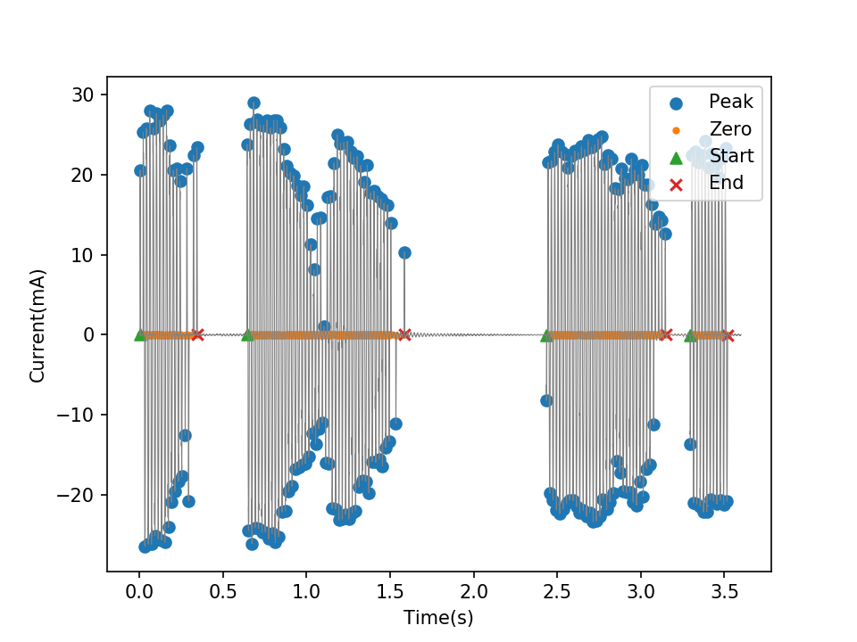
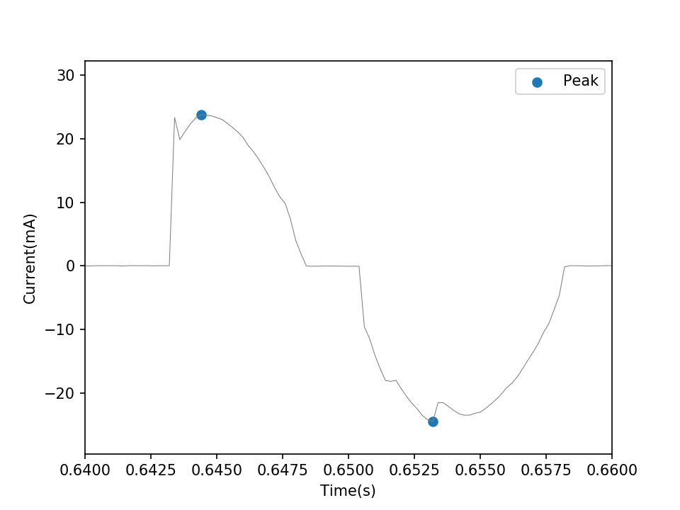
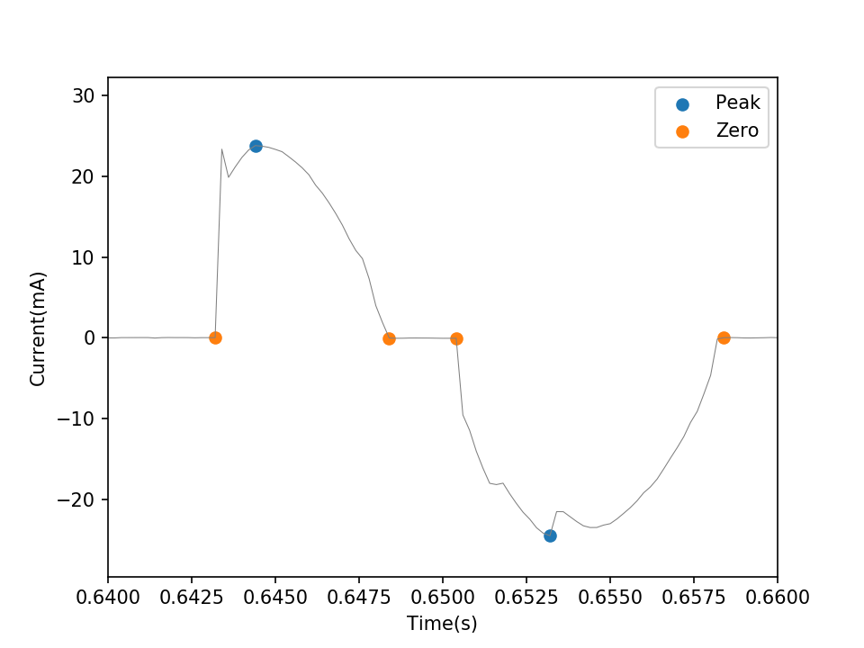
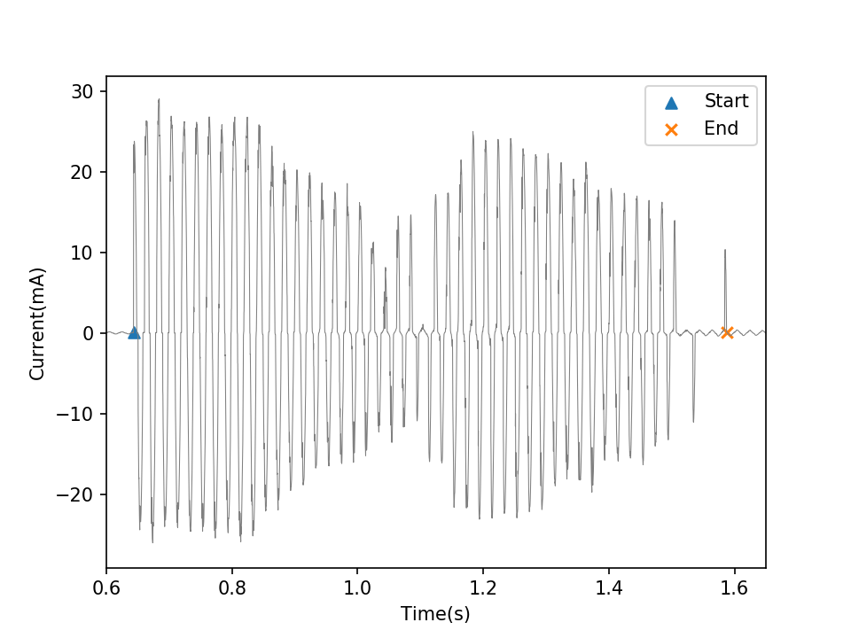
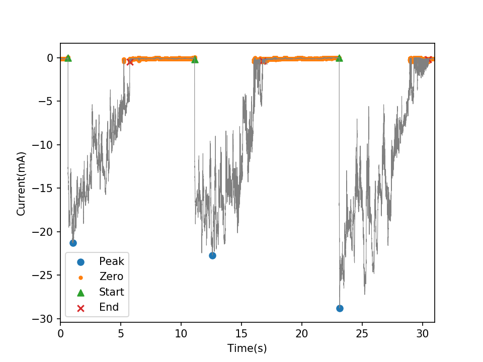
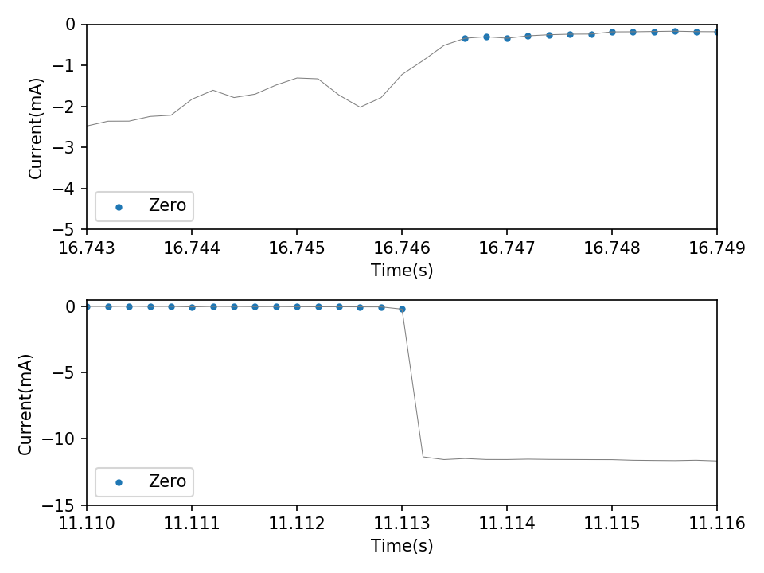
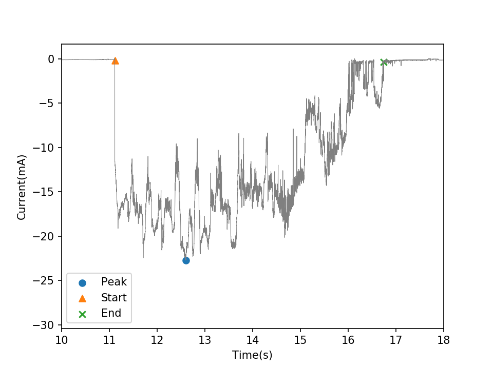

# 用于斜面法试验的电弧辨识程序
- [用于斜面法试验的电弧辨识程序](#_1)
    + [交流电弧](#_2)
        * [算例演示](#_3)
        * [核心函数](#_4)
            - [峰值识别函数](#_5)
            - [零点识别函数](#_6)
            - [电弧识别函数](#_7)
            - [阈值设置](#_8)
    + [直流电弧](#_9)
        * [算例演示](#_10)
        * [核心函数](#_11)
            - [零点识别函数](#_12)
            - [电弧识别函数](#_13)
            - [阈值设置](#_14)
    + [电弧特征参数](#_15)
        * [特征参数定义](#_16)
        * [特征参数函数](#_17)
    + [算法详情](#_18)
    + [运行环境](#_19)
    + [联系方式](#_20)
    + [LICENSE](#_21)
## 交流电弧
### 算例演示
在项目根目录下打开命令行，运行[demo_AC.py](demo_AC.py).
```shell
python demo_AC.py
```
运行结果如图[demo/AC/demo.png](demo/AC/demo.png)所示:  
[](demo/AC/demo.png)  
本算例中使用的电流数据见[demo/AC/demo_data.csv](demo/AC/demo_data.csv).  
### 核心函数
用于交流电弧辨识的核心函数代码见[identification_AC.py](identification_AC.py)，电弧辨识步骤如下:  
**峰值识别**&rarr;**零点识别**&rarr;**电弧识别**
#### 峰值识别函数
识别电流在一个周期内的峰值.
```python
ploc = getAllPeaks(crt, MPH=1, MPD=50)
```
识别效果如图[demo/AC/demo_ploc.png](demo/AC/demo_ploc.png)所示：
[](demo/AC/demo_ploc.png)
#### 零点识别函数
识别峰值点两侧的零点.
```python
zloc = getZeros(crt, ploc, TH=0.1)
```
识别效果如图[demo/AC/demo_zloc.png](demo/AC/demo_zloc.png)所示：
[](demo/AC/demo_zloc.png)
#### 电弧识别函数
识别电弧的起点和终点.
```python
arcS , arcE = getArcs(ploc, zloc, MAD=300, MPC=5)
```
识别效果如图[demo/AC/demo_arc.png](demo/AC/demo_arc.png)所示：
[](demo/AC/demo_arc.png)
#### 阈值设置
| 代号 |    定义    | 参考值 |
|------|------------|:-----:|
| MPH  | 最小峰高度 |      1 |
| MPD  | 最小峰间距 |     50 |
| TH   | 零点阈值   |    0.1 |
| MAD  | 最小弧间距 |    300 |
| MPC  | 最小峰数量 |      5 |

## 直流电弧
### 算例演示
在项目根目录下打开命令行，运行[demo_DC.py](demo_DC.py).
```shell
python demo_DC.py
```
运行结果如图[demo/DC/demo.png](demo/DC/demo.png)所示:  
[](demo/DC/demo.png)  
本算例中使用的电流数据见[demo/DC/demo_data.csv](demo/DC/demo_data.csv).  
### 核心函数
用于直流电弧辨识的核心函数代码见[identification_DC.py](identification_DC.py)，电弧辨识步骤如下:  
**零点识别**&rarr;**电弧识别**  
相较而言，直流电弧辨识难度略低于交流电弧.
#### 零点识别函数
识别电弧的零点.
```python
zloc = getZeros(crt, TH=0.5)
```
识别效果如图[demo/DC/demo_zloc.png](demo/DC/demo_zloc.png)所示：
[](demo/DC/demo_zloc.png)
#### 电弧识别函数
识别电弧的起点和终点，确定电弧电流最大值.
```python
arcS , arcE, ploc = getArcs(crt, zloc, MAW=10, MAD=1000, MPH=1)
```
识别效果如图[demo/DC/demo_arc.png](demo/DC/demo_arc.png)所示：
[](demo/DC/demo_arc.png)
#### 阈值设置
| 代号   | 定义         | 参考值   |
| ------ | ------------ |:-------:|
| TH     | 零点阈值     | 0.5      |
| MAW    | 最小弧宽度   | 10       |
| MAD    | 最小弧间距   | 1000     |
| MPH    | 最小峰高度   | 1        |

## 电弧特征参数
### 特征参数定义
| 特征参数     | 代号   |
|:-----:|:-----:|
| 燃弧时间     | **Ta** |
| 熄弧时间     | **To** |
| 最大峰值电流 | **Im** |
| 电流有效值   | **Ie** |
| 燃弧能量     | **E**  |
| 平均功率     | **P**  |

### 特征参数函数
计算电弧特征参数的函数代码见[arcParameters.py](arcParameters.py).
```python
arcP = arcParameters(crt, vol, arcS, arcE, R=33)
```
图[demo/AC/demo.png](demo/AC/demo.png)中交流电弧的特征参数为:

| Ta(s) | To(s) | Im(mA) | Ie(mA) |  E(J)  |  P(W)  |
|-------|-------|--------|--------|--------|--------|
| 0.344 | 0.296 | 28.002 | 13.982 | 16.512 | 25.832 |
| 0.945 | 0.848 | 29.014 | 12.915 | 45.091 | 25.157 |
| 0.713 | 0.144 | 24.788 | 13.541 | 36.242 | 42.299 |

图[demo/DC/demo.png](demo/DC/demo.png)中直流电弧的特征参数为:

| Ta(s) | To(s) | Im(mA) | Ie(mA) |   E(J)  |  P(W)  |
|-------|-------|--------|--------|---------|--------|
| 5.112 | 5.372 | 21.291 | 12.492 | 242.613 | 23.143 |
| 5.634 | 6.346 | 22.700 | 14.511 | 298.930 | 24.953 |

## 算法详情
[徐森,等.交流斜面法试验中的泄漏电流分析与电弧辨识.]()对电弧辨识算法做了详细的介绍.
## 运行环境
程序已在Python3.6中测试通过.程序运行依赖第三方软件包：numpy、matplotlib.  
在命令行中输入以下命令进行安装:
```shell
pip install numpy
pip install matplotlib
```
关于Numpy，请参见[http://www.numpy.org/](http://www.numpy.org/).  
关于Matplotlib，请参见[http://matplotlib.org/](http://matplotlib.org/).
## 联系方式
Emali: xusenthu@qq.com
## LICENSE
MIT LICENSE
