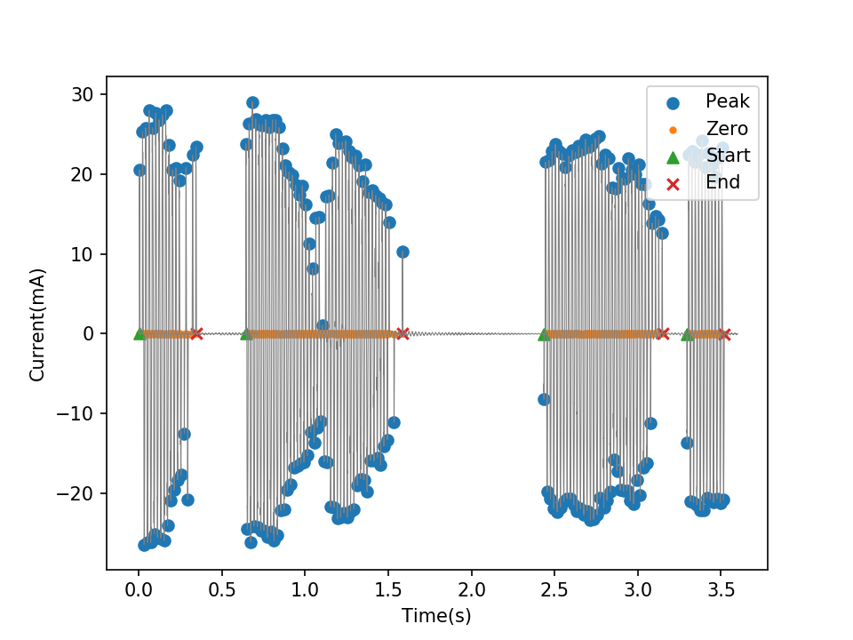
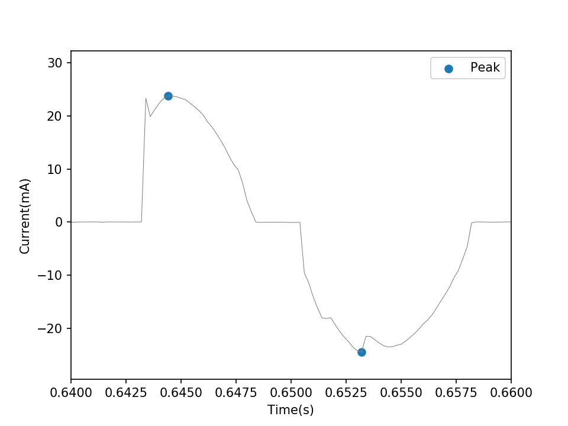
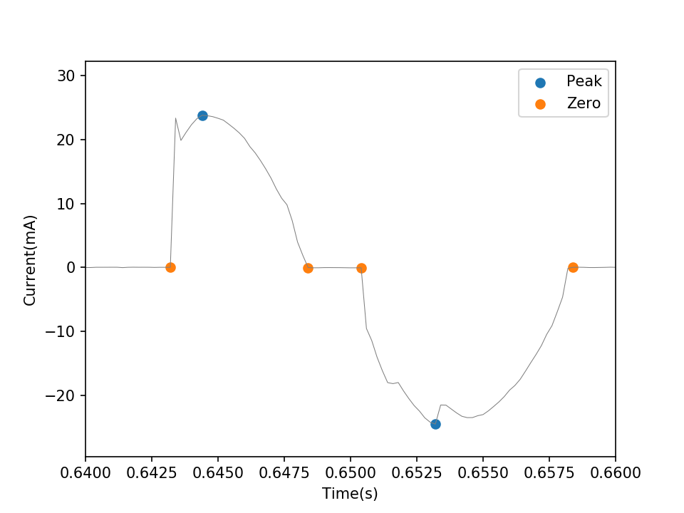
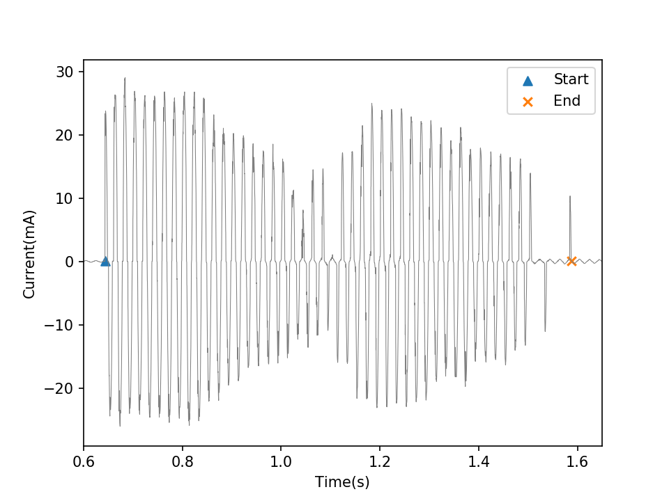

# 用于交流斜面法试验的电弧辨识程序
## 算例演示
### 运行环境
算例已在Python3.6中测试通过.
打开命令行，运行以下命令安装numpy、matplotlib.
```shell
pip install numpy
pip install matplotlib
```
关于Numpy，请参见[http://www.numpy.org/](http://www.numpy.org/).
关于Matplotlib，请参见[http://matplotlib.org/](http://matplotlib.org/).
### 运行算例
在项目根目录下打开命令行，运行[demo.py](demo.py).
```shell
python demo.py
```
运行结果如图[demo/demo.png](demo/demo.png)所示:
[](demo/demo.png)
本算例中使用的电流数据见[demo/demo_data.csv](demo/demo_data.csv).
本算例中电弧的特征参数见[demo/demo_arc.csv](demo/demo_arc.csv).
## 核心函数
核心函数代码见[identification.py](identification.py)，包括**峰值识别**、**零点识别**、**电弧识别**、**特征参数**.
### 峰值识别函数
识别电流在一个周期内的峰值.

    ploc=getAllPeaks(crt, MPH=1, MPD=50)
识别效果如图[demo/demo_ploc.png](demo/demo_ploc.png)所示：
[](demo/demo_ploc.png)
### 零点识别函数
识别峰值点两侧的零点.

    zloc=getZeros(crt, ploc, TH=0.1)
识别效果如图[demo/demo_zloc.png](demo/demo_zloc.png)所示：
[](demo/demo_zloc.png)
### 电弧识别函数
识别电弧的起点和终点.

    arcS,arcE=getArcs(ploc, zloc, MAD=300, MPC=5)
识别效果如图[demo/demo_arc.png](demo/demo_arc.png)所示：
[](demo/demo_arc.png)
### 特征参数函数
计算电弧的特征参数.

    arcP=arcParameters(crt,vol,arcS,arcE,R=33)
计算结果如下表所示：

| Ta(s) | To(s) | Im(mA) | Ie(mA) |  E(J)  |  P(W)  |
| ----- | ----- | ------ | ------ | ------ | ------ |
| 0.344 | 0.296 | 28.002 | 13.982 | 16.512 | 25.832 |
| 0.945 | 0.848 | 29.014 | 12.915 | 45.091 | 25.157 |
| 0.713 | 0.144 | 24.788 | 13.541 | 36.242 | 42.299 |

## 算法详情
[徐森,等.交流斜面法试验中的泄漏电流分析与电弧辨识.]()对电弧辨识算法做了详细的介绍.
## 联系方式
xusenthu@qq.com
## LICENSE
MIT
